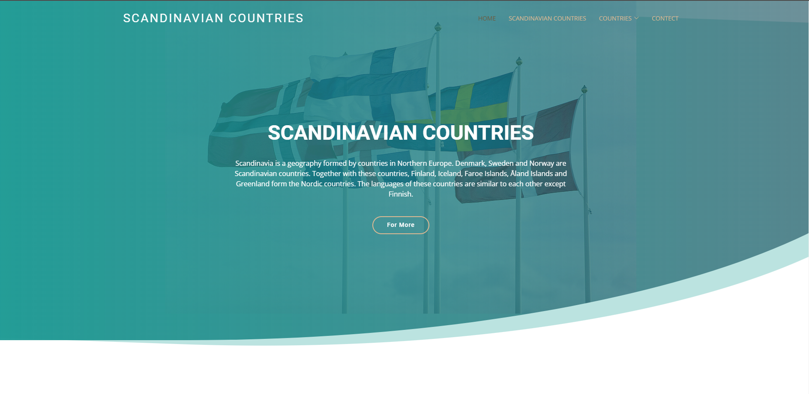
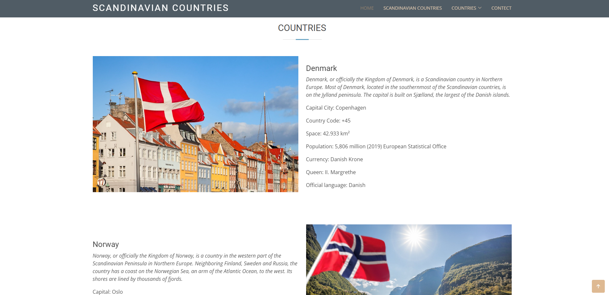
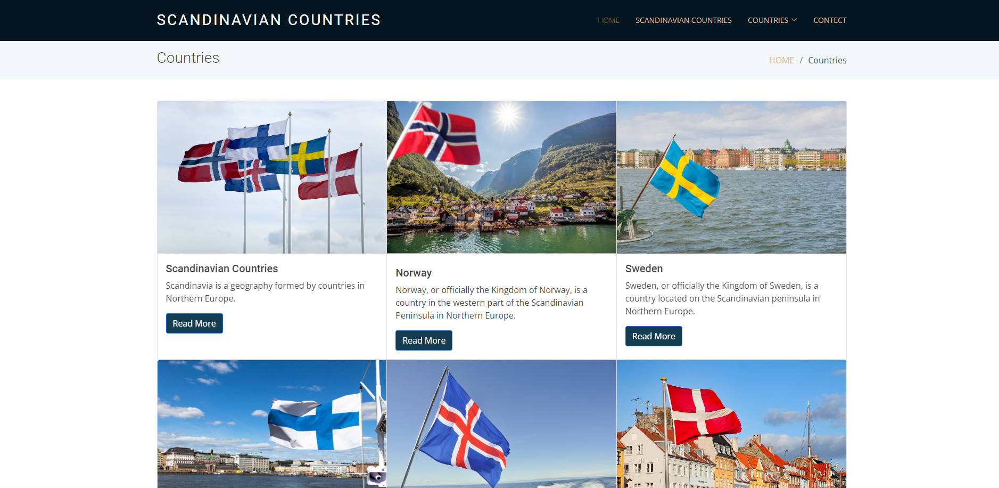
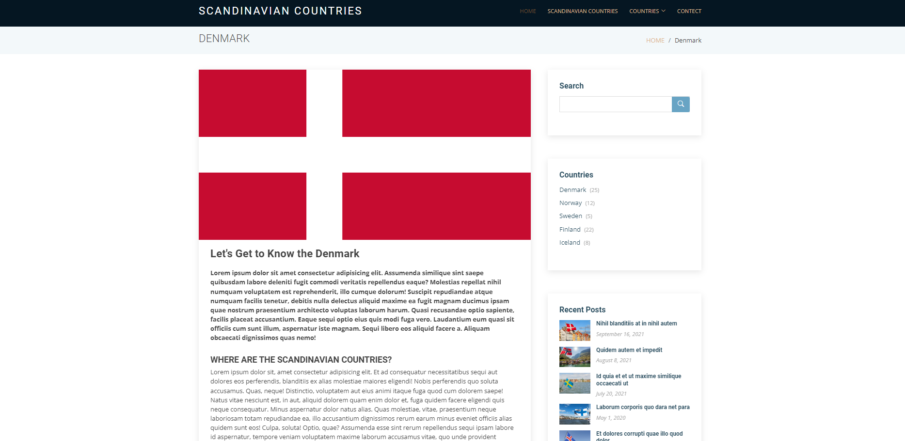
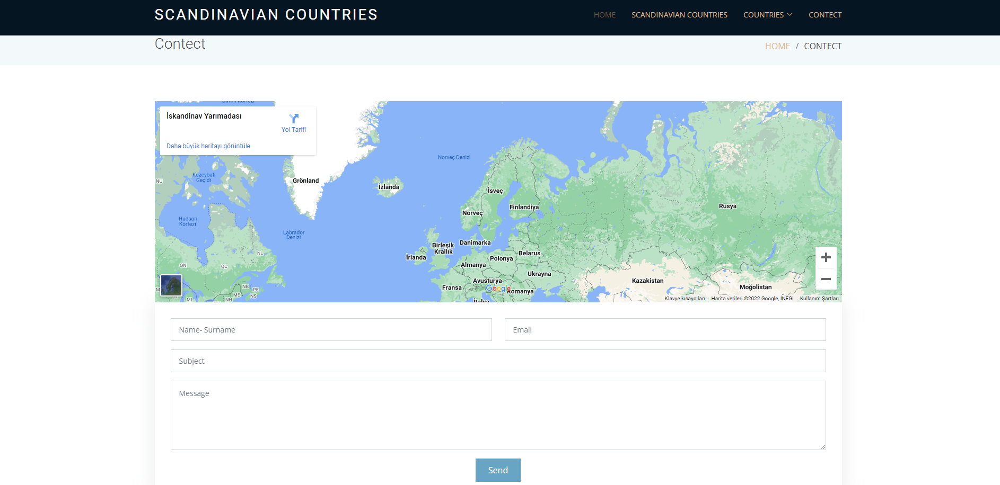

<h1>Scandinav Countries Blog Themes</h1>

Here, for the first time, I wanted to share the project that I developed using HTML-CSS and Bootstrap. I will share images about my website below

<h2>Contents</h2>

In this project, there are home page, detail pages of countries, contact page.

<h3>Home Page</h3>

<h3>Home Page</h3>

<h3>Blog Page</h3>

<h3>Blog Detais Page</h3>

<h3>Contect Page</h3>

